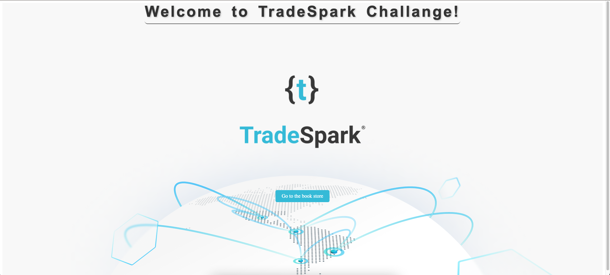

# TradeSparkChallange

# Items

## Primer punto (Angular, Front-side):
- Construir un filtro sobre la tabla en la sección "Book store", el cual sea capaz de filtrar por título, autor o categoría.
- (Done) -> Se agrego un filtro de busqueda el cual es capaz de filtrar tanto por titulo, autor o categoria.

## Segundo punto (Django, Back-side):
- Dado el título de un libro y el nombre de una categoría, implementar la eliminación de esa categoría para el libro asociado.
- (Done) -> Se agrego una funcionalidad en el backend que al recibir un titulo de libro y un nombre de categoria, busca el libro especifico por el titulo y si encuentra la categoria por el nombre la remueve, no elimina la categoria, solo la remueve de las categorias del libro

## Tercer punto (Opcional):
- Implementar un botón en la sección book store que permite eliminar una categoría perteneciente a un libro. Este botón, al ser clickeado, deberá interactuar con el backend, el cual ejecutará la lógica implementada en el segundo punto para hacer efectiva la eliminación.
- (Done) -> Antes las categorias estaban visualizadas como un string que contenia a todas, lo que hice es separar cada categoria de un libro en un item con un boton "X" que permite hacer la peticion al backend para desasociar la categoria del libro

## Extra 
- Sobrescribi los metodos "POST" para Book, Author y Category por que me iban a traer problemas a la hora de hacer pruebas creando datos, ademas como el punto 2 y 3 contemplan la eliminacion de una categoria de un libro por "titulo" y nombre de categoria" podia traerme mas problemas, la eliminacion la haria por "ID" entonces permitira la duplicacion de libros con el mismo titulo, pero como lo piden asi tengo que refactorizar para adaptarlo

## Getting started

### Prerequisites
Docker and docker-compose. for installation instructions see [here](https://docs.docker.com/install/)

#### Make sure that the docker daemon is running.

### Run the challange
1. Clone the repository
2. Run `docker-compose up` in the root directory of the repository
3. enter to localhost:4200 in your browser
4. Your has to see the following screen:

